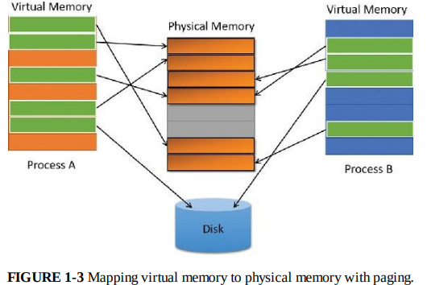

# Virtual Memory

Windows implements a virtual memory system based on a flat (linear) address space that provides each process with the illusion of having its own large, private address space. Virtual memory provides a logical view of memory that might not correspond to its physical layout. At run time, the memory manager, with assistance from hardware, translates (or maps) the virtual addresses into physical addresses, where the data is actually stored. By controlling the protection and mapping, the OS can ensure that indivisual processes don't bump into each other or overwrite OS data.

- Each process is given a flat, linear address space
- The memory manager and hardware work together to map **virtual addresses** (used by applications) to physical addresses (RAM).

> [!NOTE]
> When physical memory (RAM) is insufficient to hold the entire working set of processes, memory pages are temporarily stored on disk, this is called `paging`. Data that is not actively used is first written to the disk (page file), and when a process access a paged-out address, the OS retrieves the page from the disk into RAM

Because most systems have much less phycial memory than the total virtual memory in use by the running processes, the memory manager transfers, or `pages` some of the memory contents to disk. Paging data to disk frees physical memory so that it can be used for other processes or for the OS itself. When a thread accesses a virtual address that has benn paged to disk, the virtual memory manager loads the information back into memory from disk.

Applications don't have to be altered in any way to take advantage of paging because hardware support enables the memory manager to page without the knowledge or assistance of processes or threads.

Like shown in figure above, contiguous virtual memory chunks may be mapped to non-contiguous chunks in physical memory. These chunks are called `pages` and have a default size of 4 KB.

The size of the virtual address space varies for each hardware platform. On 32-bit x86 systems, the total virtual address space has a theoretical maximum of 4 GB. By default, Windows allocates the lower half of this address space to proccess for their unique private storage and the upper half for its own protected OS memory utilization. The mappings of the lower half change to reflaect the virtual address space of the currently executing process, but (most of) the mappings of the upper half always consist of the OS's virtual memory. Windows supports boot-time options, such as the `increaseuserva` qualifier in the Boot Configuration Database, that give processes running specially marked programs the ability to use up to 3 GB of private address space, leaving 1 GB for the OS.

> [!NOTE]
> Programs that are `specially marked` can be identified by the large address space-aware flag set in the header of the executable image.

This option allows applications such as database servers to keep larger portions of a database in the process address space, thus reducing the need to map subset views of the database on disk and therefore increasing overall performance.

> [!WARNING]
> In certain cases, the loss of 1 GB for the system can cause more pronounced system-wide performance losses.

Although 3 GB is better than 2 GB, it's still not enough virtual space to map very large, multi-gigabyte databases. To address this need on 32-bit systems, Window sprovides a mechanism called `Address Windowing Extensions (AWE)`, which allows a 32-bit application to allocate up to 64 GB of physical memory and then map views, or windows, into its 2 GB virtual address space. Using AWE puts the burden of managing the mapping of virtual to physical memory on the developer.

64-bit Windows provides a much larger address space for processes: 128 TB on Windows 8.1, Server 2012 R2, and later systems.
